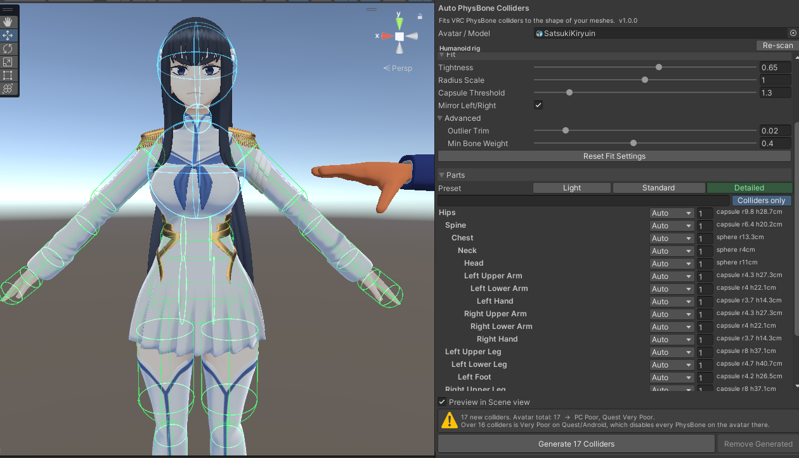
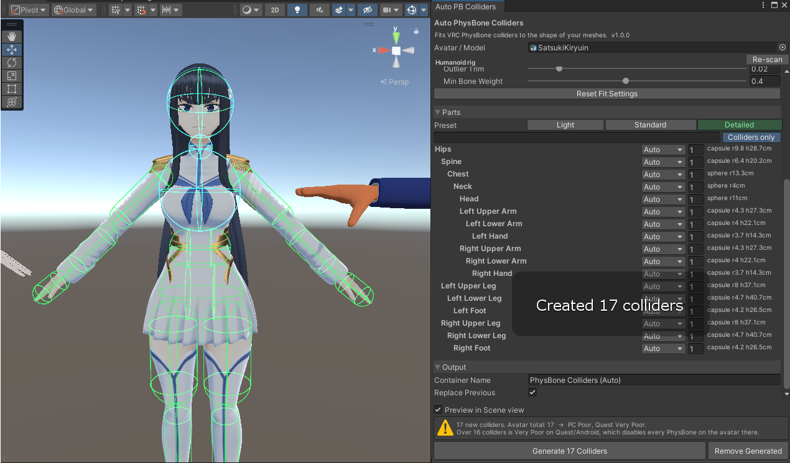
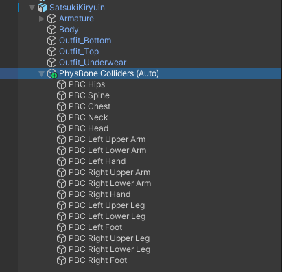
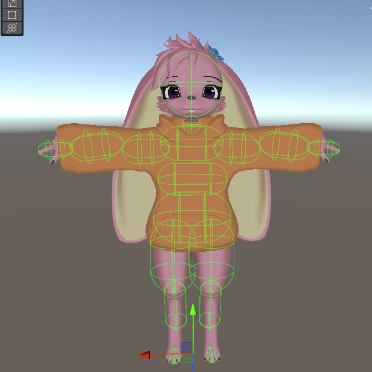
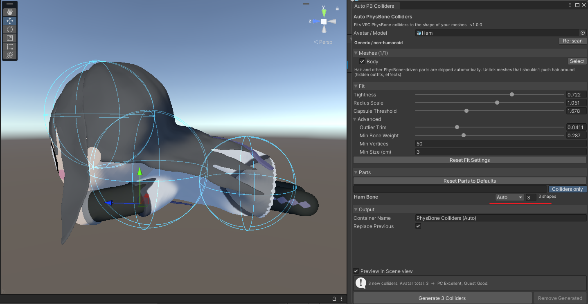
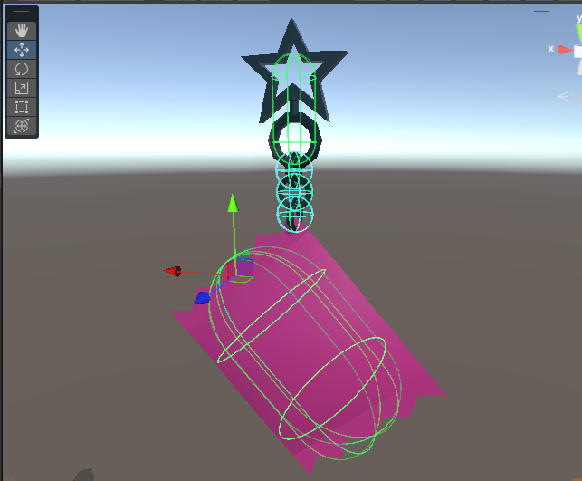

# Auto PhysBone Colliders

Looks at your meshes and generates **VRChat PhysBone colliders** (spheres and capsules) that follow the shape of your avatar or model. Works on humanoid avatars and on anything else with a mesh.



**Menu:** `Tools > Digi The Robot > Auto PhysBone Colliders`, or right-click an object in the Hierarchy and choose `Digi The Robot > Auto PhysBone Colliders`.

## Quick start

1. Open the window and drag your avatar (or any model) into **Avatar / Model**.
2. Pick a preset (humanoids): **Light** (7 colliders, Quest friendly), **Standard** (13) or **Detailed** (hands, feet and upper chest too).
3. Look at the green (capsule) and blue (sphere) preview in the Scene view. Adjust **Tightness** or **Radius Scale** if they sit too deep or stick out.
4. Optionally tick the PhysBones (hair, skirt, tail) that should collide with the new colliders.
5. Click **Generate**.

Colliders are created under a `PhysBone Colliders (Auto)` object on the avatar root. Each one points at its bone through **Root Transform**, so your armature isn't touched. Generating again replaces the old set, and any PhysBones that used the old colliders get re-linked by name. Everything can be undone with Ctrl+Z.

<table>
  <tr>
    <td></td>
    <td width="30%"></td>
  </tr>
  <tr>
    <td>After <b>Generate</b></td>
    <td>The generated colliders in the Hierarchy</td>
  </tr>
</table>

It adapts to different body shapes, like this bunny avatar with long ears and a baggy hoodie:



## Parts list

Every bone (or loose mesh object) that owns vertices shows up as a part:

| Mode | What it does |
|---|---|
| **Auto** | Fits a capsule if the part is long, otherwise a sphere |
| **Capsule / Sphere** | Forces that shape |
| **Plane** | Infinite plane on the flattest side (only for floors and similar) |
| **Merge** | Adds its vertices to the nearest parent part that makes a collider |
| **Skip** | Ignored |

The number box next to a collider part **splits** it into that many shapes (k-means over the part's enclosed volume). This is the main tool for non-humanoid props and creatures.



Rigged props get a shape for each bone, like this charm on a chain: a sphere for every link, and capsules for the star and the flat base.



Default modes:

- **PhysBone-driven bones** (hair, tails, skirts) are skipped automatically.
- **Fingers, eyes, jaw, shoulders and twist bones** merge into their parent.
- **Unmerged outfit armatures** (Modular Avatar / VRCFury) are routed to the avatar bone with the same name, so they don't create duplicates.
- **Loose static meshes** on avatars are off by default. You can tick them under **Meshes**.

## How the fitting works

1. **Sampling.** Each vertex belongs to its strongest bone (if that weight is at least *Min Bone Weight*). The mesh's bind pose puts the vertex in that bone's space, so the current pose doesn't matter. Current blendshape weights are applied, so shrink keys and body sliders count.
2. **Density leveling.** Points are resampled on a voxel grid so detailed areas (faces, eyes, mouths) don't outvote simple ones.
3. **Axis.** Humanoid bones use anatomy: limbs point at the next bone, torsos run left-right, heads follow the neck. Everything else uses the mesh's principal axis (PCA).
4. **Size.** Trimmed extents along the axis give the length. The *Tightness* percentile of distance from the axis gives the radius, so stray vertices don't bloat anything.
5. **Symmetry.** Left and right humanoid pairs are averaged.

The results are converted with the same math VRChat uses at runtime: offsets and radii scale by the largest lossy-scale axis, and capsule height is the full end-to-end length including the caps. That means scaled armatures (like Blender exports at 100x) come out right.

## Performance ranks

PhysBone collider limits as of SDK 3.5:

| Rank | PC | Quest / Android |
|---|---|---|
| Excellent | 4 | 0 |
| Good | 8 | 4 |
| Medium | 16 | 8 |
| Poor | 32 | 16 |

On Quest/Android an avatar that's **Very Poor** for PhysBones has all of its PhysBones disabled. The window shows the total so you can stay under the limit.

Collision checks count too: every PhysBone × collider pair adds up, so only assign colliders to chains that need them.

## Compatibility

- Any VRChat Avatars SDK that includes PhysBones (3.0 and newer). There's no compile-time reference to the SDK: components are found by reflection and edited through `SerializedObject`. The tool compiles in projects without the SDK and shows a message instead.
- Unity 2019.4 and newer (C# 7.3).
- Editor-only. Nothing from this tool ships with your upload except the standard VRChat collider components it creates.

## Installing

**unitypackage (easiest):** download the latest `.unitypackage` from [Releases](https://github.com/digi-the-robot/Auto-Physbone-Colliders/releases) and import it. Files land in `Assets/!Digi/AutoPhysBoneColliders`.

**Package Manager (git URL):** in Unity open `Window > Package Manager`, click **+ > Add package from git URL...** and paste (needs [Git](https://git-scm.com/) installed):

```
https://github.com/digi-the-robot/Auto-Physbone-Colliders.git
```

Add `#v1.0.0` to the end to pin a specific version.

## License

[MIT](LICENSE). Free to use, modify and share, including in paid projects, as long as the copyright notice stays with the code.
